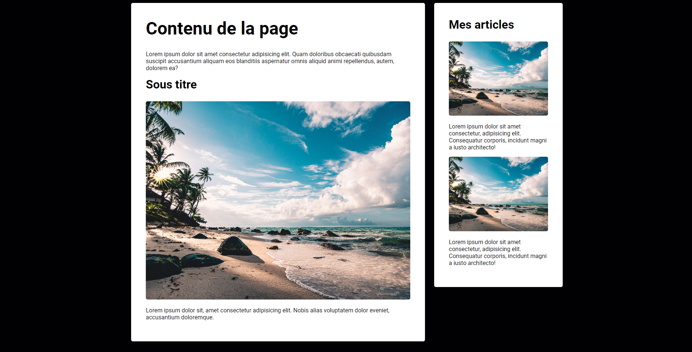

<<<<<<< HEAD
# Projet 5 : Page d'accueil - avec flexbox

Ce projet est un exemple de Page d'accueil - avec flexbox que j'ai réalisé dans le cadre de mon parcours d'apprentissage en HTML & CSS.

## Aperçu du Contenu

- `index.html` : Le fichier HTML principal contenant la structure de la page.
- `styles.css` : Le fichier CSS contenant les styles pour le site web.
- `images/` : Le dossier contenant les images utilisées dans le site web.
=======
# Projet 5 : Page d'accueil - avec flexbox

Ce projet est un exemple de Page d'accueil - avec flexbox que j'ai réalisé dans le cadre de mon parcours d'apprentissage en HTML & CSS.

## Aperçu du Contenu

- `index.html` : Le fichier HTML principal contenant la structure de la page.
- `styles.css` : Le fichier CSS contenant les styles pour le site web.
- `images/` : Le dossier contenant les images utilisées dans le site web.
>>>>>>> b4982fb14c36a5dd109337b2cd61cb3828c325e5
