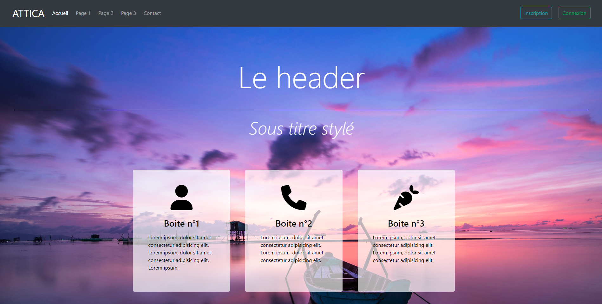
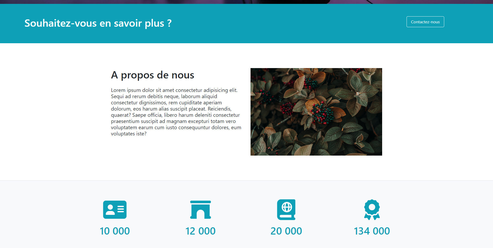
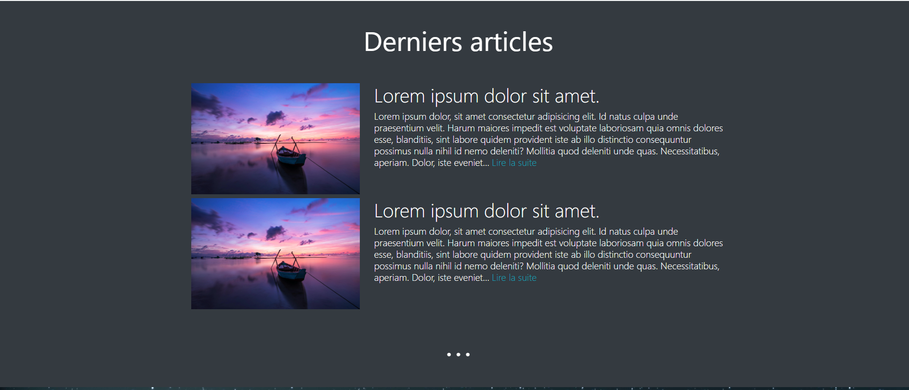
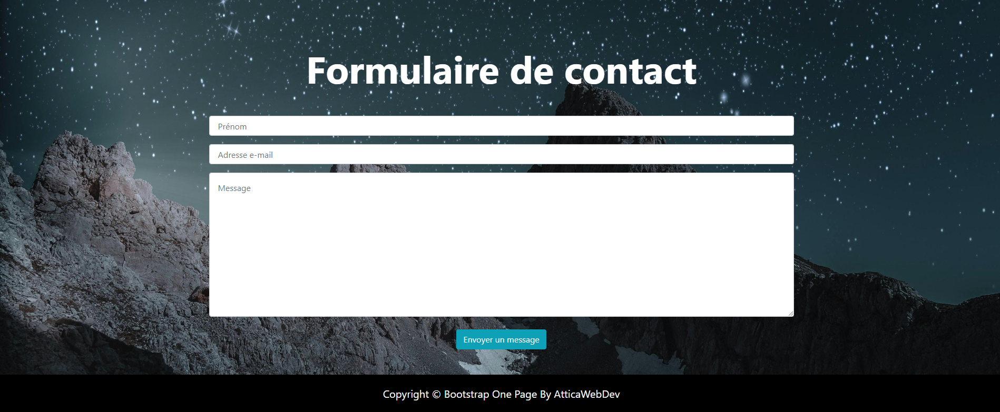

# Projet 7 : Site One Page avec Bootstrap

Ce projet est un exemple de Site One Page avec Bootstrap que j'ai réalisé dans le cadre de mon parcours d'apprentissage en HTML & CSS.

## Aperçu du Contenu

- `index.html` : Le fichier HTML principal contenant la structure de la page.
- `styles.css` : Le fichier CSS contenant les styles pour le site web.
- `images/` : Le dossier contenant les images utilisées dans le site web.
