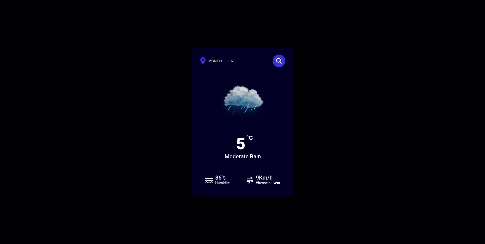

# CloudChase V1 | Weather App

Bienvenue dans CloudChaser, votre application météo personnelle développée en HTML, CSS et JavaScript. Cette application simple vous permet de consulter rapidement les informations météorologiques pour une localité spécifique.

## Aperçu

## Fonctionnalités

- Recherche de la météo : Saisissez le nom de la ville dans le champ de recherche pour obtenir les informations météorologiques actuelles.

- Affichage des données : Une fois que vous avez soumis la requête, les données météorologiques détaillées, telles que la température, l'humidité, la vitesse du vent, et la description du temps, sont affichées à l'écran.

- Icônes météorologiques : Des icônes intuitives accompagnent les informations pour une compréhension rapide des conditions météorologiques.

## Technologies utilisées

- HTML
- CSS
- JavaScript
